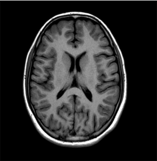
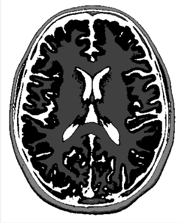
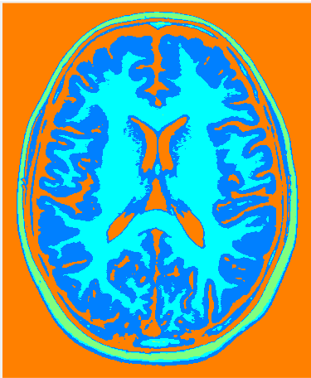
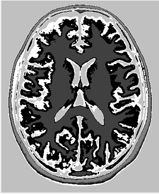

# Segmentation-of-MRI-brain-images

The image segmentation process leverages the Markov Random Field (MRF) model, a powerful probabilistic framework ideal for modeling spatial interactions among pixels. By treating the image as a grid where each pixel is represented as a node in the network, the MRF approach enables robust segmentation based on the statistical dependencies between neighboring pixels.

Each pixel’s classification is influenced by its neighbors, encouraging pixels with similar characteristics to belong to the same segment while preserving boundary details where there is a noticeable change. The segmentation process iteratively refines the pixel labels by minimizing an energy function that combines observed image data (likelihood) with spatial coherence (prior) constraints, ultimately producing a smooth and coherent segmentation.

This method is particularly effective for images with noise or varying textures, as it relies on the contextual relationships within the image rather than individual pixel values, achieving high-quality segmentation with clearly defined boundaries.

## Example
**Original Image**
------

**Segmentation with MRF algorithm**
------

**Segmentation with K-means algorithm**
------

